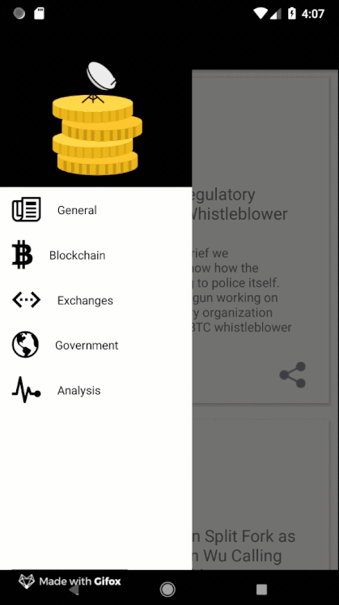

## INFO



```
This application shows different news related to the cryptocurrency field.
The navigation is managed with a drawer that has five links to different categories. 
With a click on a category, the user is redirected to a page with a list of news. 
The user can share the news or click on it to read the full article. 
The article is shown inside a webview.

A login section is also available, but it is not yet complete. 
Based on the offical forum, the Auth0 solution has some problems with the callbacks.
This happen only with React Native. 
I should find a way to fix this part and implement a login view.
```

## TECHNOLOGIES
```
For the development of this mobile application I used the 
React Native framework with Redux (management of the state).

For the navigation of the app I decided to go for the 
[React Native Navigation library](https://github.com/wix/react-native-navigation) 
that gives me the possibility to easily implement navigation options like drawer or tabs.

No third party libraries used for the styling of the application.
```


